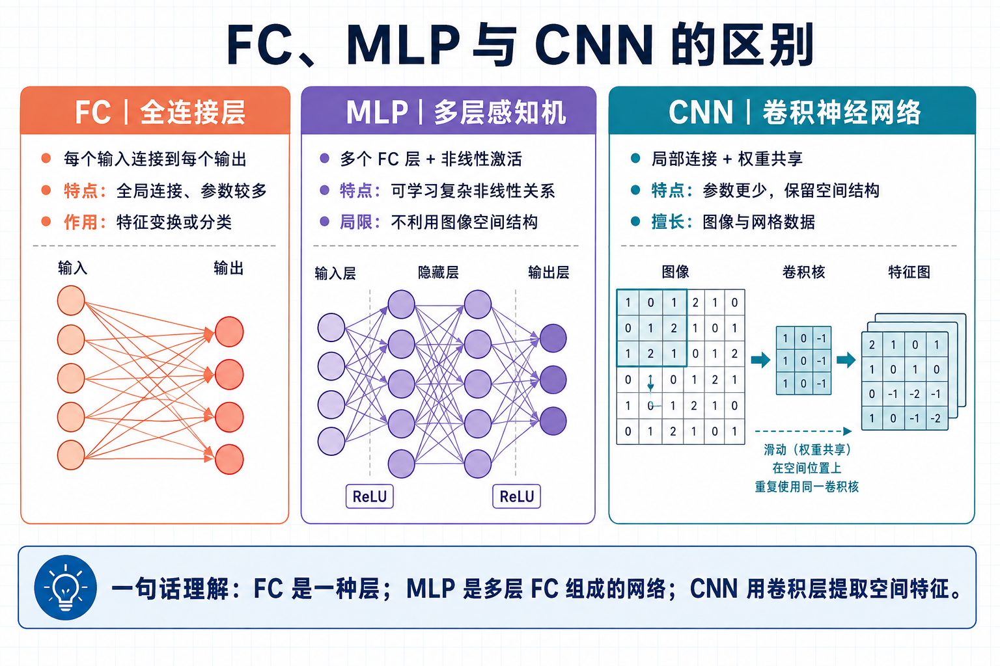

# 最小案例 1：训练 sin 模型

> 类型：`PY` ｜ 验证状态：待验证 ｜ 后续：[`microcourses/02_quantize_sin_model`](../02_quantize_sin_model/)

## 摘要

这是整门课第一次动手训练模型：让一个小神经网络学会 **输入 x，输出 sin(x)**。准备数据、搭模型、训练、看 loss、导出模型——不管任务多复杂，深度学习的骨架都是这一套，这里用几分钟就能跑完的例子把它走通。产出的 `sin_model.onnx` 会在最小案例 2 被量化成 `.espdl`，最小案例 3 装进 ESP32-S3 真正跑起来。**全程在电脑上运行，不需要开发板，也不需要 GPU。**

## Quick Start

**预备知识**

- 已安装 Miniconda/Anaconda；
- 课程统一使用 `esp32s3` conda 环境（Python 3.11），没有就先创建（约 1\~3 分钟）：
  ```bash
  conda create -n esp32s3 python=3.11 -y
  ```
- 知道 `y = sin(x)` 的图像是一条波浪线即可，不需要深度学习基础。

以下步骤从仓库根目录 `esi-mvp-code/` 开始。

**第 1 步：激活 conda 环境**（成功后提示符前出现 `(esp32s3)`）

```bash
conda activate esp32s3
```

**第 2 步：进入案例目录**（`ls` 应能看到 `sin_model.py` 和 `requirements.txt`）

```bash
cd microcourses/01_train_sin_model
```

**第 3 步：安装依赖**（torch 有几百 MB，首次约 3\~10 分钟；`esp-ppq` 本集不用，是为最小案例 2 提前装好的）

```bash
python -m pip install -r requirements.txt
```

**第 4 步：运行训练**（纯 CPU 约 1\~3 分钟；每 50 轮打印一行 train/val loss，应总体下降。想快速验证流程可改 `--epochs 20`，但小轮数模型未收敛，不能用于验收对照）

```bash
python sin_model.py --epochs 500 --seed 42 --output-dir outputs
```

**第 5 步：检查产物**（应看到 5 个文件：`sin_model.pth`、`sin_model.onnx`、`loss_history.csv`、`loss_curve.png`、`fit_curve.png`；CSV 有表头 `epoch,train_loss,val_loss`；两张 PNG 里 loss 曲线应下降趋平，红色 Predicted 曲线应基本贴着蓝色波浪线）

```bash
ls outputs
head -3 outputs/loss_history.csv
```

**（可选）Notebook 方式**：[`train.ipynb`](train.ipynb) 只做训练和导出，[`visualize.ipynb`](visualize.ipynb) 只读产物绘图，逻辑与脚本一致。

## 预期现象

成功时终端输出**格式**如下（格式示例，具体数值以本机运行为准；本案例验证状态为"待验证"，不预设固定 loss 数字）：

```text
Epoch [50/500], train loss: 0.xxxxx, val loss: 0.xxxxx
...（每 50 轮一行）...
final train loss: 0.xxxxx, final val loss: 0.xxxxx
saved: outputs/loss_history.csv
...（共 5 行 saved:，对应 5 个产物文件）...
```

- 5 行 `saved:` 缺任何一个都说明没跑完；以 `final` 行或 CSV 最后一行为准，把实际 train/val loss 记入实验报告；
- 失败时保留完整终端报错，对照下方排查表；ONNX 检查或简化失败时，不要把不完整的 ONNX 交给最小案例 2。

**常见问题排查**

| 现象                                               | 原因               | 解决办法                                                        |
| ------------------------------------------------ | ---------------- | ----------------------------------------------------------- |
| `ModuleNotFoundError: No module named 'torch'` 等 | 没激活环境或依赖没装       | `conda activate esp32s3` 后重装 `requirements.txt`             |
| `conda: command not found`                       | 终端没初始化 conda     | Windows 用 Anaconda Prompt；macOS/Linux 执行 `conda init` 后重开终端 |
| pip 装 torch 很慢或超时                                | 网络问题、包体积大        | 换国内镜像，如加 `-i https://pypi.tuna.tsinghua.edu.cn/simple`      |
| `FileNotFoundError` 找不到 `sin_model.py`           | 当前目录不对           | 先 `cd microcourses/01_train_sin_model` 再运行                  |
| onnx.checker / onnxsim 报错                        | 版本不匹配或导出被打断      | 按 requirements.txt 重装 onnx/onnxsim，删除旧 ONNX 后重跑             |
| loss 不降、震荡或发散                                    | 学习率过大或 epochs 太少 | 用默认 `lr=1e-4`，`--epochs` 恢复 500 再观察                         |

## 学习目标

- 运行训练脚本，检查 `outputs/` 中五类产物是否完整；
- 用自己的话解释训练集、验证集测试集的概念和 MSE loss 的作用；
- 从终端输出或 `loss_history.csv` 读出最终的训练/验证 loss；
- 解释导出的 ONNX 为什么要固定 batch=1、静态输入 shape；
- 看懂 `fit_curve.png`：红色预测曲线是否贴住带噪声的蓝色曲线。

## 原理讲解

**这个案例在做什么**

像教学生查正弦表：给他 1000 道题（"输入 x，正确答案 sin(x)"，答案故意加了噪声），每次答错就告诉他错得多离谱，他据此微调思路；学完几百轮后，再用没见过的题考他，答得不错才算真学会。对应到代码：

- 学生 = `SinPredictor` 模型；题目 = `generate_data()` 生成的样本；错得多离谱 = MSE loss；
- 微调 = Adam 优化器更新参数；学完一轮 = 一个 epoch；没见过的题 = 验证集。

**MLP：最简单的神经网络**

模型是 3 层 MLP：`1 → 64 → 64 → 1`——输入 1 个数字，经过两层 64 个神经元的隐藏层，输出 1 个数字。每层都是"乘权重、加偏置"（全连接层），层间用 ReLU 提供"弯折"能力；没有 ReLU，再多层也只是一条直线，拟合不出波浪。

**ReLU 是什么？**

ReLU = Rectified Linear Unit，中文叫**线性整流单元**，它是神经网络里最常用、最基础的激活函数。公式非常直观：

```text
ReLU(x) = max(0, x)
```

用大白话说：**正数原样通过，负数全部变成 0**。

| 输入 x | ReLU(x) | 解释 |
|--------|---------|------|
| 3.0    | 3.0     | 正数，保持不变 |
| 0.0    | 0.0     | 零，还是零 |
| -2.0   | 0.0     | 负数，被“掐掉” |
| -0.5   | 0.0     | 负数，也被“掐掉” |

**为什么需要 ReLU？**

因为如果没有激活函数，神经网络不管堆多少层，本质上都是一个线性变换：`y = W × x + b`。无论乘多少个权重矩阵，最后都可以合并成一个大矩阵。线性函数画出来永远是直线，永远拟合不了 sin(x) 这种波浪线。

ReLU 通过把一部分负数“掐掉”，给模型引入了**非线性**。这样神经网络才能拟合曲线、曲面，处理图像、语音等复杂任务。

**ReLU 在本案例中的作用**

sin(x) 是波浪线，如果模型只有线性层，输出永远是一条直线，永远不可能贴合正弦波。加上 ReLU 之后，模型可以在中间层“折出”各种形状，最终逼近波浪线。

> 思考题：为什么最后一层 `fc3` 之后不加 ReLU？因为 sin(x) 在 π～2π 区间是负数，如果最后一层加 ReLU，负数会被全部掐成 0，模型永远预测不出负值，拟合不出完整的正弦波。所以输出层不加 ReLU，保留负值。


> 图：小型 MLP 把一个输入值映射为一个输出值。节点数量仅示意层次关系，不代表代码中的实际参数数量。



> 图：全连接层、MLP 与 CNN 的结构对照。本案例只用 MLP；扩展案例 1 的 MobileNetV2 属于 CNN。

**batch、epoch、loss**

- **batch**：一次只喂 32 个样本（`batch_size=32`），算一次平均错误、更新一次参数，小步快走更稳定；
- **epoch**：把全部训练样本完整过一遍，默认训练 500 个 epoch；
- **loss**：衡量预测和正确答案差多少，本例用 MSE（误差平方后求平均），越小越好。

**MSE loss 是什么？**

MSE = Mean Squared Error，中文叫**均方误差**，大白话就是“预测值离真实答案有多远，取个平均”。公式写成：

```text
MSE = (1/n) × Σ (预测值 - 真实值)²
```

以本案例为例，模型预测某个 x 对应的 sin(x)：

| 输入 x | 真实 sin(x) | 模型预测 | 误差 | 误差² |
|--------|------------|---------|------|------|
| 0.5    | 0.479      | 0.500   | 0.021 | 0.000441 |
| 1.0    | 0.841      | 0.800   | -0.041 | 0.001681 |
| 1.5    | 0.997      | 1.010   | 0.013 | 0.000169 |

把所有 `(预测 - 真实)²` 加起来除以样本数，就是这一轮训练要降低的 MSE。

为什么要**平方**？

1. **避免正负抵消**：如果不平方，预测偏高和预测偏低会互相抵消，看起来误差很小，实际都在错。
2. **放大错得远的点**：差 0.1 的平方是 0.01，差 0.5 的平方是 0.25。模型会优先修正那些错得离谱的样本。

所以训练时不断打印的 `train loss` / `val loss` 就是 MSE。它越小，说明红色预测曲线越贴近蓝色真实曲线；如果 MSE 一直降不下去，说明模型还没学会，可能要检查学习率、训练轮数或模型结构。

**为什么加噪声、为什么分训练/验证集**

生成的 y 是 `sin(x) + 0.05 × 随机噪声`，模拟真实世界的输入从不完美。数据按 80/20 划分：训练集（800 个）更新参数，验证集（200 个）从不参与训练、只用来打分。训练 loss 低而验证 loss 高，说明模型在"背题"（过拟合）——所以每轮要同时记录两个 loss。

**ONNX：模型的"通用存档格式"**

`.pth` 只有 PyTorch 认识；导出成 ONNX，最小案例 2 的量化工具（ESP-PPQ）才能读懂，相当于把"PyTorch 方言"翻译成"普通话"。导出时固定 **batch=1、静态 shape** **`[1, 1]`**——ESP32 这类小设备按固定大小提前分配内存，不接受可变形状。导出后还会用 `onnx.checker` 检查、`onnxsim` 简化，保证文件干净可用。

## 整体流程图

```text
sin_model.py
    ├─ generate_data() → 训练/验证张量（80/20 划分，batch_size=32）
    ├─ SinPredictor + Adam(lr=1e-4) + MSE → loss_history.csv（每轮 train/val loss）
    ├─ torch.onnx.export(batch=1) + onnx.checker + onnxsim → sin_model.onnx（最小案例 2 量化输入）
    ├─ torch.save → sin_model.pth（最小案例 2 浮点对照用）
    └─ matplotlib → loss_curve.png / fit_curve.png
```

## 关键代码解析

片段来自 [`sin_model.py`](sin_model.py)，只截取核心部分。

**1. 模型定义：3 层 MLP**

```python
class SinPredictor(nn.Module):
    def __init__(self):
        super(SinPredictor, self).__init__()
        self.fc1 = nn.Linear(1, 64)   # 输入 1 维 → 64 维
        self.fc2 = nn.Linear(64, 64)
        self.fc3 = nn.Linear(64, 1)   # 64 维 → 输出 1 维

    def forward(self, x):
        x = torch.relu(self.fc1(x))   # ReLU 提供非线性
        x = torch.relu(self.fc2(x))
        x = self.fc3(x)               # 输出层不加 ReLU：sin(x) 有负值，
        return x                      # ReLU 会把负数全截成 0
```

`super(SinPredictor, self).__init__()` 这一行是调用父类 `nn.Module` 的初始化：PyTorch 需要在 `__init__` 里完成内部的数据结构准备（比如子模块注册、参数追踪、前向图管理），才能识别后续 `self.fc1`、`self.fc2` 这些层，并让 `model.parameters()`、`model.state_dict()`、保存权重、量化工具读取等后续操作都正常工作。不写这一行，网络层虽然能创建，但不会被注册进模型，训练时也不会被更新。

```python
def generate_data(num_samples=1000, noise=0.05):
    """生成 [0, 2π] 区间带噪声的正弦样本；最小案例 2 量化也复用它生成校准数据。"""
    x = torch.linspace(0, 2 * np.pi, num_samples)       # 0~2π 均匀取点
    y = torch.sin(x) + noise * torch.randn(num_samples) # 真值 + 噪声
    return x.unsqueeze(1), y.unsqueeze(1)               # [N,1]，匹配模型输入
```

**3. 训练循环：固定套路**

```python
for batch_x, batch_y in train_loader:   # 每次取 32 个样本
    y_pred = model(batch_x)             # 前向：算预测值
    loss = criterion(y_pred, batch_y)   # 算 MSE loss
    optimizer.zero_grad()               # 清掉上一轮梯度
    loss.backward()                     # 反向传播：算梯度
    optimizer.step()                    # Adam 更新参数
```

"前向 → 清梯度 → 反向 → 更新"是所有 PyTorch 训练代码的固定套路，以后会反复见到。

## 关键文件说明

| 文件/目录                                                               | 职责                          | 类型   |
| ------------------------------------------------------------------- | --------------------------- | ---- |
| [`sin_model.py`](sin_model.py)                                      | 训练、评估和 ONNX 导出入口（一键运行）      | 课程代码 |
| [`train.ipynb`](train.ipynb) / [`visualize.ipynb`](visualize.ipynb) | Notebook 版：只训练导出 / 只读产物绘图   | 课程代码 |
| [`requirements.txt`](requirements.txt)                              | Python 依赖（含最小案例 2 所需 esp-ppq） | 配置   |
| `assets/fc_mlp_cnn.jpg`                                             | 全连接/MLP/CNN 结构对照素材          | 静态资源 |
| `outputs/loss_history.csv`                                          | 每轮 train/val loss（验收表格数据源）  | 生成物  |
| `outputs/loss_curve.png` / `outputs/fit_curve.png`                  | loss 曲线 / 预测对照图             | 生成物  |
| `outputs/sin_model.pth`                                             | PyTorch 权重（最小案例 2 浮点对照用）      | 生成物  |
| `outputs/sin_model.onnx`                                            | ONNX 模型（最小案例 2 量化输入）          | 生成物  |

## 配置说明

| 修改位置           | 配置项                              | 现象变化                   |
| -------------- | -------------------------------- | ---------------------- |
| 命令行            | `--epochs`（默认 500）               | 训练时间和拟合程度；过小可能未收敛      |
| 命令行            | `--seed`（默认 42）                  | 固定随机性便于复现；换 seed 结果略不同 |
| 命令行            | `--num-samples` / `--output-dir` | 样本数量 / 产物写入目录          |
| `sin_model.py` | `lr=1e-4`                        | 学习率；调大可能震荡，调小收敛慢       |
| `sin_model.py` | `noise=0.05`                     | 数据噪声幅度；调大后拟合曲线更"毛糙"    |
| `sin_model.py` | `batch_size=32`                  | 每步更新的样本数，影响速度与稳定性      |

## 术语小表

| 术语            | 解释                                                |
| ------------- | ------------------------------------------------- |
| MLP           | 多层感知机，最基础的神经网络，全由全连接层（`nn.Linear`）组成；本例 1→64→64→1 |
| ReLU          | 激活函数：负数变 0、正数不变，给模型"拐弯"能力                         |
| epoch         | 训练集完整过一遍；本例默认 500                                 |
| batch         | 一次送入模型的一小批样本；本例每批 32 个                            |
| loss / MSE    | 损失值衡量预测和答案差多少；MSE 把误差平方后取平均                       |
| 学习率           | 每次参数更新的"步子大小"，本例 Adam 用 `lr=1e-4`                 |
| 训练集/验证集       | 前者更新参数，后者只打分，用于发现过拟合                              |
| 过拟合           | 训练集上表现好、新数据上表现差，即死记硬背                             |
| 随机种子          | 固定随机性让结果可复现；本例 42                                 |
| ONNX / `.pth` | 跨框架模型交换格式（ESP-PPQ 等工具能读懂）/ PyTorch 的权重文件格式        |

## 验证清单

- [ ] `conda activate esp32s3` 成功，依赖安装退出码为 0；
- [ ] 训练脚本退出码为 0，终端出现 5 行 `saved:`；
- [ ] `loss_history.csv` 有表头 `epoch,train_loss,val_loss` 和逐轮记录；
- [ ] 两张 PNG 能打开：loss 总体下降、预测曲线贴合波形；
- [ ] `sin_model.onnx` 通过脚本内置的 onnx.checker 与 onnxsim 检查（没报错即通过）；
- [ ] 记录运行日期、依赖版本和最终 train/val loss 数值。

## 思考题与拓展挑战

**思考题**

1. 为什么要同时保留训练 loss 和验证 loss？

   \*\*参考答案：\*\*训练 loss 反映对训练样本的拟合，验证 loss 反映对没见过数据的泛化；两者的差距有助于发现过拟合。
2. 为什么导出时使用 batch=1、静态输入 shape？

   \*\*参考答案：\*\*端侧按固定输入缓冲区分配内存，静态 shape 可以简化量化、内存规划和 ESP-DL 加载。
3. 为什么最后一层 `fc3` 之后不加 ReLU？

   \*\*参考答案：\*\*ReLU 会把负数全变成 0，而 sin(x) 在 π\~2π 区间是负的；加了就永远预测不出负值，拟合不了完整正弦波。

**拓展挑战**

- 在不改变模型结构的前提下比较两个随机种子，提交 loss 曲线和差异解释；
- 在约束输出文件格式不变的前提下增加一个可复现的评估指标。

